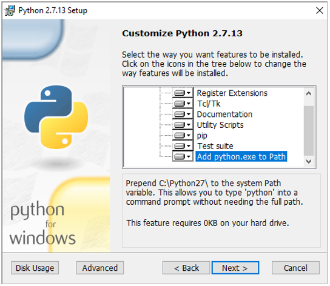

#Cartoview
##Installation Requirements
- Install [Python2.7](https://www.python.org/)

- Install [1.8.7 <= Django <1.9a0](https://pypi.python.org/pypi/Django/1.8.7)

	!!! attention "Docker users"
	    - you need to install [docker-compose](https://docs.docker.com/compose/install/)


##Install On Ubuntu linux
- Follow these setps if you don't have Geonode  installed on your ubuntu system.<br/>

- These instructions will install [Geonode][1] and Cartoview.

	!!! note
	    Verify your installation is completed by adding any layer in [Geonode][1]


- Don't Forget [Installation requirements](installation.md#installation-requirements)

- Install [Geonode=2.6][1]

- Install CartoView Libraries

	``` python
	pip install cartoview
	```


- Install CartoView_Django Project

	``` sh
	django-admin.py startproject --template=https://github.com/cartologic/cartoview-project-template/archive/master.zip --name django.env,uwsgi.ini,.bowerrc,server.py <your_project_name>
	```

- Go to your Project Folder

	``` sh
	cd <your_project_name>
	```


- Detect changes in ```app_manager``` App

	``` sh
	python manage.py makemigrations app_manager
	```

- create people Table

	``` sh
	python manage.py migrate people
	```

	!!! bug
		this command will fire an error ignore it

- Create Rest of tables :

	``` sh
	python manage.py migrate
	```

- load default User

	``` sh
	python manage.py loaddata sample_admin.json
	```

- load default oauth app

	``` sh
	python manage.py loaddata json/default_oauth_apps.json
	```

- Test Server (Development)
	- To start Development Server run this Command :

		``` sh
		python manage.py runserver 0.0.0.0:8000
		```

!!! Note "Info"
	 **(Optional)** if want to override any settings variable rename ```local_settings.py.sample``` to ```local_settings.py``` then override settings you want inside ```local_settings.py```


!!! warning
	Don't Forget to Change ```<your_project_name>``` to desired name.

!!! important "Apps From Geo App Market"
	- to Install apps from [Geo App Market][2]

	- Load Default Store

		``` sh
		python manage.py loaddata app_stores.json
		```

  	- Install [nodejs](https://nodejs.org/en/) and then install [bower](https://bower.io/) we need them to install app_manager dependencies
	- in this step we will install required files in your project folder type :
		```sh
		bower install
		```
	- Collect Required files type:
		```sh
		python manage.py collectstatic --noinput
		```
	- Now you Can Install Apps from [Geo App Market][2]
	- Go to ```apps``` tab and click ```manage apps``` Button and install app you want


##Install On Windows

- Install [Python2.7](https://www.python.org/)
	- Make Sure to add the Python in the Path, as this is not setup by default
	- check add python.exe to PATH
		
		
- Install Django 1.8.7 open cmd and type:

	```sh
	pip install django==1.8.7
	```

**We recommend to use Docker**

- Follow [Docker Instructions](docker.md#docker)


##Existing GeoNode Users
Check GeoNode and Cartoview version compatibility in [PYPI][4] then install Cartoview

- Requirements:
	- GeoNode == 2.5.15

	!!! attention
		We will Support more version of Geonode Soon!!

- install cartoview libraries

	``` sh
	pip install cartoview == <version>
	```

- Create Cartoview Project

	``` sh
	django-admin.py startproject --template=https://github.com/cartologic/cartoview-project-template/archive/master.zip --name django.env,uwsgi.ini,.bowerrc <your_project_name>
	```

- Go to your Project Folder

	``` sh
	cd <your_project_name>
	```

- detect Changes in app_manager

	``` sh
	python manage.py makemigrations app_manager
	```

- create People table

	``` sh
	python manage.py migrate people
	```

	!!! bug
		this command will fire an error ignore it

- create rest of database tables
	``` sh
	python manage.py migrate
	```

- Collect static Files

	``` sh
	python manage.py collectstatic --noinput
	```

- Now Development Server :
	``` sh
	python manage.py runserver 0.0.0.0:8000
	```
##Deployment notes

- !!! warning "Important"
	in Production Configure Geoserver before uploading layers from [here](http://docs.geonode.org/en/master/tutorials/admin/geoserver_geonode_security/#geoserver-security-backend)

- !!! warning "Important"
	Once CartoView is installed is expected to install all apps from the app store automatically
	At the moment CartoView will fully support apache server only
	For nginx deployments, CartoView will be able to detect new apps and get the updates, how ever to apply the updates, web server restart will be required to complete 		the process
	CartoView will not be able to restart nginx when new apps are installed.
	After you install or update apps from the app manager page you will need to restart nginx manually until this issue is addressed in the future
	- follow these steps to get apps working on nginx
		- collect static files using this commands
			``` sh
			python manage.py collectstatic --noinput
			```
		- restart server now you should restart server after installing any app
[1]: https://github.com/GeoNode/geonode
[2]: http://www.cartoview.org
[3]: http://demo.cartoview.net
[4]: https://pypi.python.org/pypi/cartoview
[5]: https://github.com/cartologic/cartoview/issues
[6]: http://cartoview.org/app/cartoview_map_viewer/
[7]: http://cartoview.org/app/cartoview_feature_list/
[8]: http://cartoview.org/app/cartoview_geonode_viewer/
[9]: https://twitter.com/ahmednosman
[10]: https://twitter.com/cartoview
[11]: https://www.docker.com/products/docker
